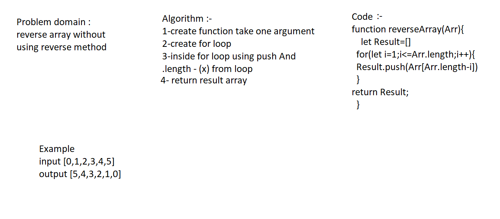

# Reverse an Array
<!-- Short summary or background information -->
using Result.push(Arr[Arr.length-i]) inside the loop to make a Result array equal reverse array

## Challenge
<!-- Description of the challenge -->
make reverse array without using reverse method

## Approach & Efficiency
<!-- What approach did you take? Why? What is the Big O space/time for this approach? --> 

## Solution
<!-- Embedded whiteboard image -->

# Data Structures and Algorithms

See [setup instructions](https://codefellows.github.io/setup-guide/code-301/3-code-challenges), in the Code 301 Setup Guide.

## Repository Quick Tour and Usage

### 301 Code Challenges

Under the `data-structures-and-algorithms` repository, at the top level is a folder called `code-challenges`

Each day, you'll add one new file to this folder to do your work for the day's assigned code challenge

### 401 Data Structures, Code Challenges

- Please follow the instructions specific to your 401 language, which can be found in the directory below, matching your course.
