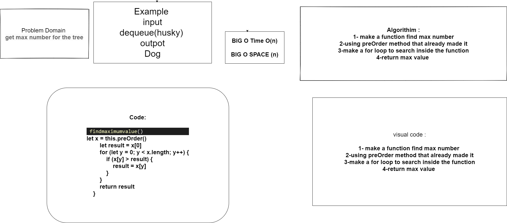

# Max Number
get max number to binary tree 
## Challenge
## Approach & Efficiency
## API
<!-- Embedded whiteboard image -->
using preOrder methd and search inside the array for max val
## Test 
* for test  npm test BinaryTree.js

whiteBoard

## [pull_req](https://github.com/ayoubkandah/data-structures-and-algorithms/pull/31)

