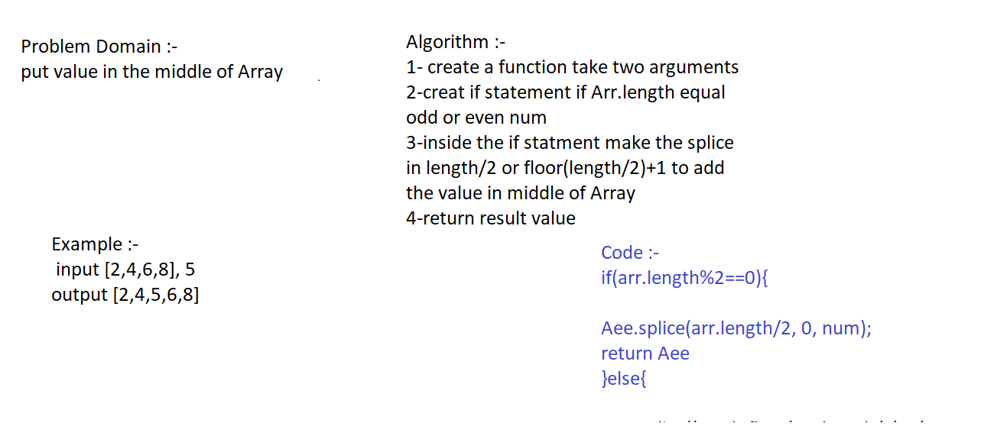

## arrayShift an Array
<!-- Short summary or background information -->
using splice(Arr.length/2,"the value what we want")

## Challenge
<!-- Description of the challenge -->
put the value in the middle if the arr.length odd or even num

## Approach & Efficiency
<!-- What approach did you take? Why? What is the Big O space/time for this approach? --> 

## Solution
<!-- Embedded whiteboard image -->

