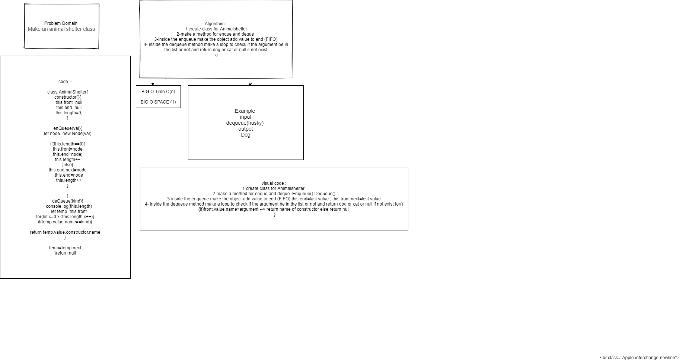

#  fifo animal shelter
creating queue for dog and cat obj
## Challenge
NA
## Approach & Efficiency
## API
<!-- Embedded whiteboard image -->
create class for Animalshelter and make two method enqueue and dequeue that everyone take one argument enqueue for adding value to top of list and dequeue for check if the arg cat or dog and return it or return null if not exist 
## Test 
* for test  npm test fifo-animal-shelter.
## [Pull request](https://github.com/ayoubkandah/data-structures-and-algorithms/pull/27)
## whiteboard

