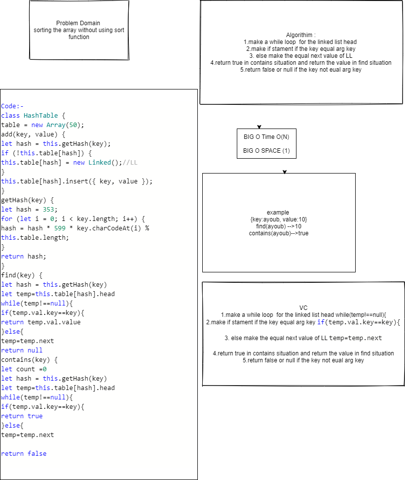

#  Hash Table 
create hash table with contains and find methods
## Challenge
find method
## Approach & Efficiency
BIG O TIME  O(N)
BIG O SPACE O(1)
## API
<!-- Embedded whiteboard image -->
contain method : get a key from gethash method and make a loop to search if the key exist for table or not and return true if yes or false or not
find methods : get a key from gethash method and make a loop to search if the key exist return the value
## Test 
* for test  npm test hashtable .

#[pul_request](https://github.com/ayoubkandah/data-structures-and-algorithms/pull/37)

