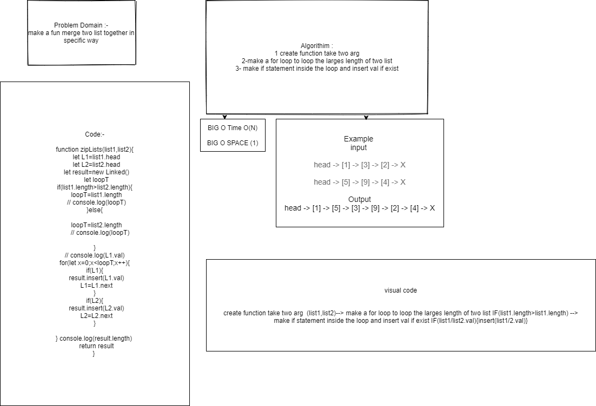

#  zipLists
create fun take 2 arg of list and merge it in specific way
## Challenge
how to merge it in specific way
## Approach & Efficiency
## API
<!-- Embedded whiteboard image -->
## Test 
* for test  npm test linked-list.
## [Pull request](https://github.com/ayoubkandah/data-structures-and-algorithms/pull/23)

## White Board 

