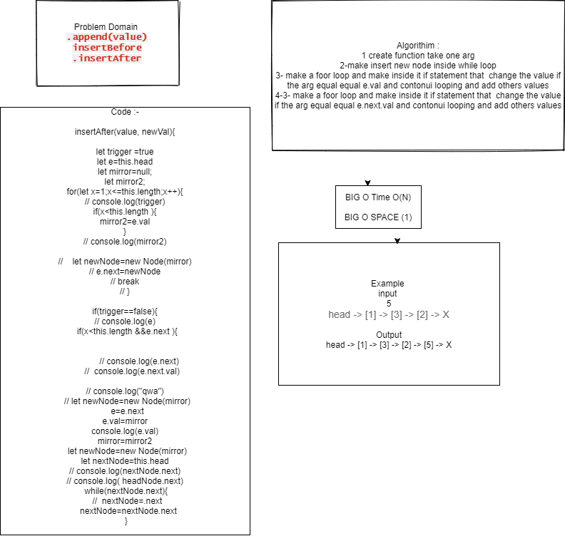
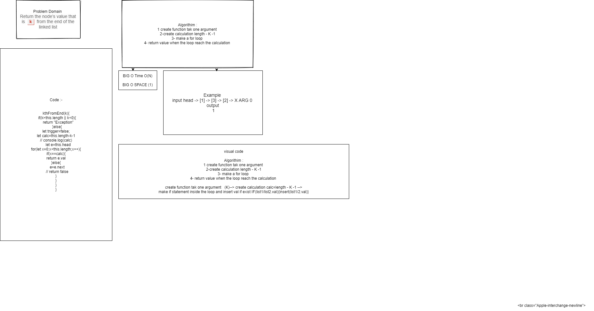

#  Linked Lists
creating LL thats save value in the head if there is no value and save to next if insert many values
## Challenge
how to insert many values
## Approach & Efficiency
## API
<!-- Embedded whiteboard image -->
create class for node and class for LL and make function that Insert values and include value and tostring fun 
## Test 
* for test  npm test linked-list.

## CODE 06
### [Pull_Request with check lsit code Challenge 06](https://github.com/ayoubkandah/data-structures-and-algorithms/pull/20)

## CODE 07
BIG O TIME O(N)
BIG O SPACE O(1)
### [Pull_Request with check lsit code Challenge 07](https://github.com/ayoubkandah/data-structures-and-algorithms/pull/22)

