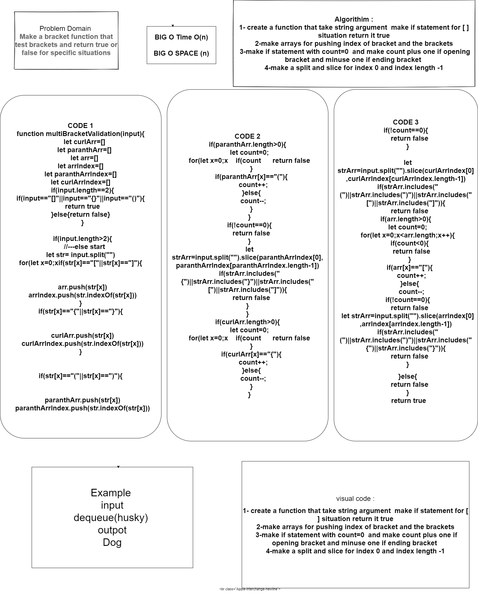

#  Multi Bracket Validation
creating a function that take an string argument that return true or false if there is brackets and in specific way like [] return true || [{}] return false
## Challenge
NA
## Approach & Efficiency
## API
<!-- Embedded whiteboard image -->
convert a string to array by using split("") and deal with the array by looping and push brackets to specific arrays and make if statements for every situation 
## Test 
* for test  npm test multi-bracket-validation.

## white board

