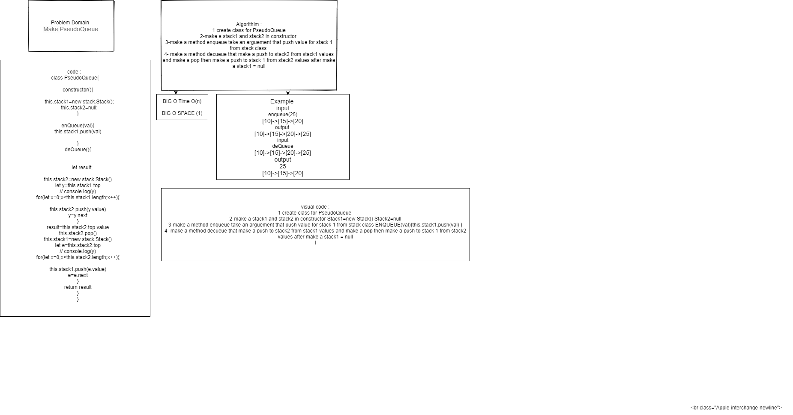

#  STACK QUEUE
creating a list with 2 stack and psedo queue
## Challenge
how to multiple decueue 
## Approach & Efficiency
## API
<!-- Embedded whiteboard image -->
create class for PQ make a two method for enqueue and dequeue
## Test 
* for test  npm test queue-with-stacks.
## [pull_request](https://github.com/ayoubkandah/data-structures-and-algorithms/pull/25)
## white board

