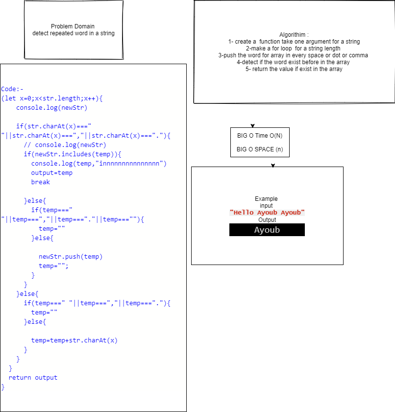

#  Repeated word
make a function take a one argument for a string that dedect repeated word

## Challenge
## Approach & Efficiency
## API
<!-- Embedded whiteboard image -->

## Test
* for test  npm test repeatedWord

# White-Board

