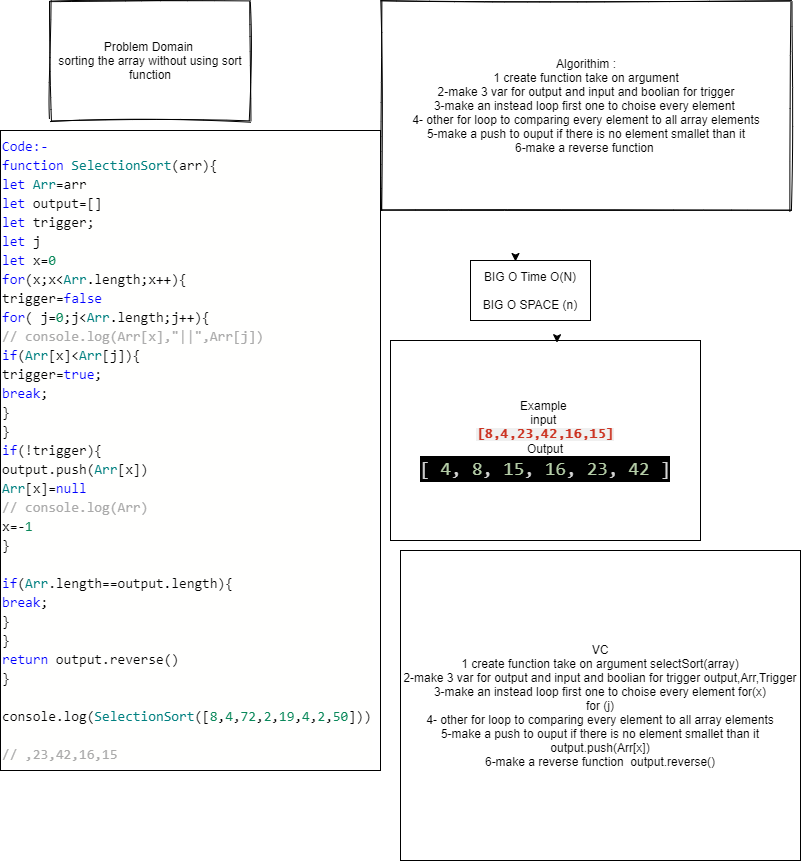

## Trace
### 1({

[8,4,23,42,16,15]

make a for loop to get every element in array and declare 3 variables output and input array and boolian

});

### 2({

output=[42]

make instead loop to compare every element to all array if the element biggest one will push it in output and change the index of biggest one to null to not comparing again and make the first for loop  looping again by make the x =-1

});

### 3({

output=[42,23]
it will looping again and comparing again and it will push other biggest one

});

### 4({
we will got this result 
output=[42 ,23 , 16 , 15 , 8, 4 ]

then return output.revrse() to get the result what we want

[ 4, 8, 15, 16, 23, 42 ]

});

Time: O(n^2)
Space: O(n)

For testing use npm test sort

[Pull Request](https://github.com/ayoubkandah/data-structures-and-algorithms/pull/33)

White Board

