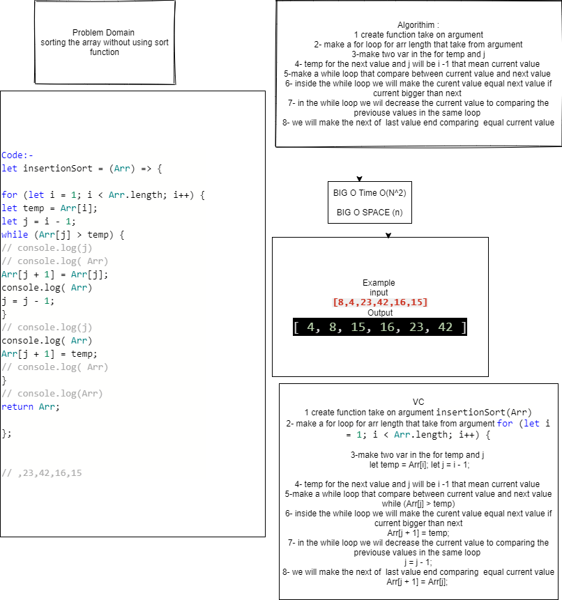

Trace
1({

[8,4,23,42,16,15]

make a for loop for arr that have j -1 and temp of the value of next arr value and j-1 for current 

})

2({
     [8,4,23,42,16,15] --->[4,8,23,42,16,15]

make a while loop and make the condition while current or previouse value bigger than next value the current value will be equal next value and make j -1 to sure if the all previouse values will be smaller than current . in this case a while loop will be looping just one time because 8 > 4 and there is no value before the 4

})

3({

[4,8,23,42,16,15] -->[4,8,23,42,16,15] -->[4,8,23,42,16,15] 
 

now the temp will be 23 and prev value 8 it will not enter the while loop and it will run last command that Arr[j+1]=temp in this case j=1 and it will not enter the while loop so the j it will be as is so  Arr[j+1]=temp in this case will be Arr[2]=temp that mean it will be same thing nothing change and same thing in next case 

})

4({
[4,8,23,42,16,15] -->[4,8,16,23,42,15]

in this situation temp =16 and the prev value 42 --> j=3 so the while loop will etering but in this case the while loop will looping 2 times first time it will comparing between 42 and 16 and the j will decrease 1 and 16 will equal 42 and it will looping next time for comparing between previouse value will be 23 and it bigger than temp value so it will enter and 42 it will equal 23 and 16 it will end looping by comparing between 16 and 8 so it will run last command that mean first 23 will equal 16 
[4,8,23,42,16,15]-->[4,8,23,42,42,15]-->[4,8,23,23,42,15]-->[4,8,16,23,42,15]

and same thing for next case 

})

Time: O(n^2)
Space: O(n)

For testing use npm test sort

White Board

