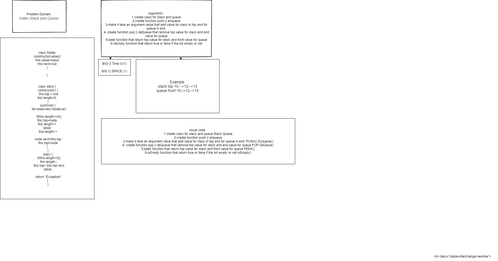

#  STACK QUEUE
creating list thats save value in the top for stack and end for queue if there is no value and save to next if insert many values
## Challenge
how to insert many values
## Approach & Efficiency
## API
<!-- Embedded whiteboard image -->

create class for node and class for STACK && QUEUE and make function that PUSH AND ENQUEUE values and POP() DEQUEUE  value and isEmpty() and peek()
## Test
* for test  npm test stack-and-queue.
## [Pull Request](https://github.com/ayoubkandah/data-structures-and-algorithms/pull/24) 
## white board

