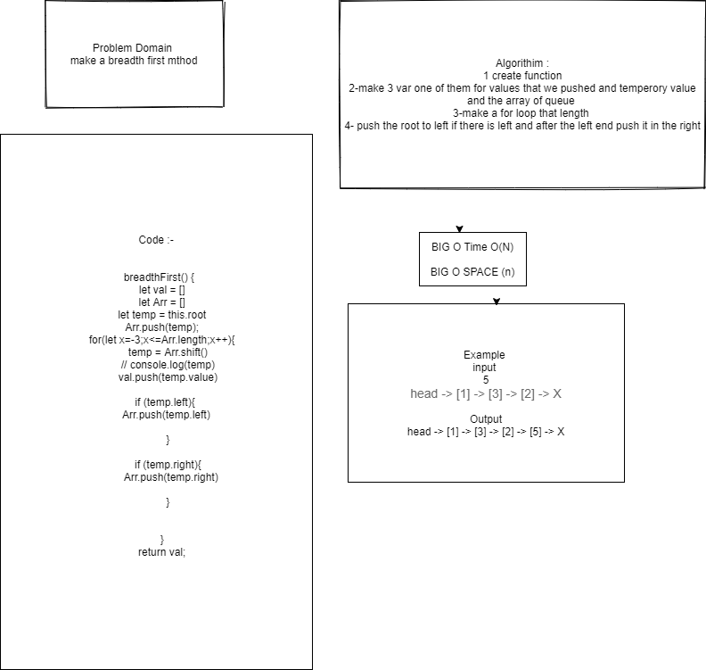

#  Breadth First
function that sort the queue by breadth first
## Challenge
## Approach & Efficiency
## API
<!-- Embedded whiteboard image -->
make a loop that push value to arr if the left exist and after that push in the right 
## Test 
* for test  npm test tree.js

whiteboard

[pull-req](https://github.com/ayoubkandah/data-structures-and-algorithms/pull/32)
